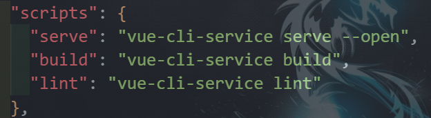
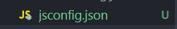
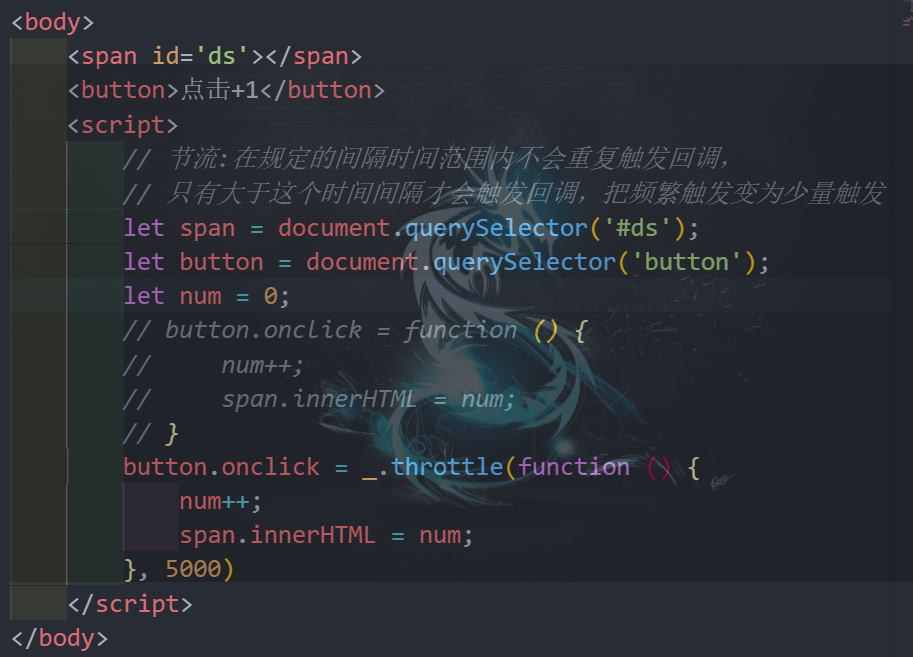
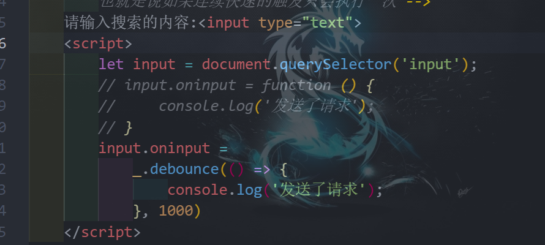
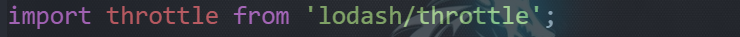

# 1.关于一些方便的配置

## 1.1运行自动打开网页



在package.json中的这个位置加入--open

## 1.2@路径



在根目录创建该文件jsconfig.json,在其中写入以下内容可以将src路径替换为@，并且有提示

```json
{
    "compilerOptions": {
        "baseUrl": "./",
        "paths": {
            "@/*": [
                "src/*"
            ]
        }
    },
    "exclude": [
        "node_modules",
        "dist"
    ]
}
```


# 2.新版路由器的变化

重写push和replace方法，新版的router中的这些方法都是promise类型，要传resolve和reject

```js
let originPush = VueRouter.prototype.push;
let originReplace = VueRouter.prototype.replace;

VueRouter.prototype.push = function (location, resolve, reject) {
  if (resolve && reject) {
    originPush.call(this, location, resolve, reject)
  } else {
    originPush.call(this, location, () => { }, () => { })
  }
}

VueRouter.prototype.replace = function (location, resolve, reject) {
  if (resolve && reject) {
    originReplace.call(this, location, resolve, reject)
  } else {
    originReplace.call(this, location, () => { }, () => { })
  }
}
```

# 3.nprogress进度条

网页顶端的进度条显示，在请求开始和结束使用

```javascript
//ajax.js
import nprogress from "nprogress";
//ajax.js
import "nprogress/nprogress.css";
//如果很多地方用才导到main.js
nprogress.start()
nprogress.done();
```

# 4.防抖和节流

https://www.lodashjs.com/

节流:在规定的间隔时间范围内不会重复触发回调，只有大于这个时间间隔才会触发回调，把频繁触发变为少量触发



防抖:前面的所有的触发都被取消，最后次执行在规定的时间之后才会触发，也就是说如果连续快速的触发只会执行一次



按需导入



# 5.委派时用指定的dom

使用`data-……` 

```javascript
 if (e.target.dataset.……) {}
```

# 6.关于等待数据完全返回的操作

## 6.1第一种方法:回调

直接把要执行的函数传到获取数据之后执行

## 6.2第二种方法:监视

用watch监视数据，在里面直接执行函数

> 其中用$nextick的原因是这个方法是在循环结束之后执行，更能保证数据的结构

# 7.swiper

安装:`npm i swiper@5 -S`

使用：

```javascript
//
import Swiper from 'swiper';
//main.js
import "swiper/css/swiper.css";
```


```html
<div class="swiper-container">
    <div class="swiper-wrapper">
        <div class="swiper-slide">Slide </div>
        <div class="swiper-slide">Slide </div>
        <div class="swiper-slide">Slide </div>
    </div>
    <!-- 如果需要分页器 -->
    <div class="swiper-pagination"></div>
    
    <!-- 如果需要导航按钮 -->
    <div class="swiper-button-prev"></div>
    <div class="swiper-button-next"></div>
    
    <!-- 如果需要滚动条 -->
    <div class="swiper-scrollbar"></div>
</div>
```

```javascript
        new Swiper('.swiper-container', {
          loop: true, // 循环模式选项
          // 如果需要分页器
          pagination: {
            el: '.swiper-pagination',
            //点击小球的时候也切换图片
            clickable: true
          },
          // 如果需要前进后退按钮
          navigation: {
            nextEl: '.swiper-button-next',
            prevEl: '.swiper-button-prev'
          }
        });
```

# 8.Object.assign()的使用

```javascript
Object.assign() 
//方法用于将所有可枚举属性的值从一个或多个源对象复制到目标对象。它将返回目标对象。
Object.assign(target, ...sources)   
//【target：目标对象】，【souce：源对象（可多个）】
```

```tex
如果目标对象中的属性具有相同的键，则属性将被源对象中的属性覆盖。后面的源对象的属性将类似地覆盖前面的源对象的属性
```

# 9.关于发送请求

如果将请求参数的某个属性设置成undefined，发送请求时就不会携带这个参数

# 10.includes函数

includes() 方法用于判断字符串是否包含指定的子字符串。

如果找到匹配的字符串则返回 true，否则返回 false。

**注意：** includes() 方法区分大小写。

# 11.Math.ceil()函数

ceil() 方法将数字向上舍入为最接近的整数，并返回结果。

如果传递的参数是整数，则不会舍入该值。

说明

ceil() 方法执行的是向上取整计算，它返回的是大于或等于函数参数，并且与之最接近的整数

# 12.分页器的设计

需要知道当前是第几个:pageNo字段代表当前页数
需要知道每一页需要展示多少条数据: pageSize字段进行代表
需要知道整个分页器一共 有多少条数据:total字段进行代表---[获取另外一条信息:一共多少页] 
需要知道分页器连续页码的个数:5|7 [奇数]，以为奇数对称(好看)
总结:对于分页器而言，自定义前提需要知道四个前提条件。
pageNo:当前第几个
pageSize:代表每页展示多少条数据
total:代表整个分页一共要展示多少条数据
continues :代表分页连续页码个数

```vue
<template>
  <div class="pagination">
    <!-- 上 -->
    <button :disabled="pageNo == 1" @click="$emit('getPageNo', pageNo - 1)">
      上一页
    </button>
    <button
      v-if="startNumAndEndNum.start > 1"
      @click="$emit('getPageNo', 1)"
      :class="{ active: pageNo == 1 }"
    >
      1
    </button>
    <button v-if="startNumAndEndNum.start > 2">···</button>
    <!-- 中间部分 -->
    <button
      v-for="(page, index) in startNumAndEndNum.end"
      :key="index"
      v-if="page >= startNumAndEndNum.start"
      @click="$emit('getPageNo', page)"
      :class="{ active: pageNo == page }"
    >
      {{ page }}
    </button>

    <!-- 下 -->
    <button v-if="startNumAndEndNum.end < totalPage - 1">···</button>
    <button
      v-if="startNumAndEndNum.end < totalPage"
      @click="$emit('getPageNo', totalPage)"
      :class="{active:pageNo==totalPage}"
    >
      {{ totalPage }}
    </button>
    <button
      :disabled="pageNo == totalPage"
      @click="$emit('getPageNo', pageNo + 1)"
    >
      下一页
    </button>

    <button style="margin-left: 30px">共 {{ total }} 条</button>
  </div>
</template>

<script>
export default {
  name: "Pagination",
  props: ["pageNo", "pageSize", "total", "continues"],
  computed: {
    //总共多少页
    totalPage() {
      //向上取整
      return Math.ceil(this.total / this.pageSize);
    },
    //计算出连续的页码的起始数字与结束数字[连续页码的数字:至少是5]
    startNumAndEndNum() {
      const { continues, pageNo, totalPage } = this;
      //先定义两个变量存储起始数字与结束数字
      let start = 0,
        end = 0;
      //连续页码数字5【就是至少五页】，如果出现不正常的现象【就是不够五页】
      //不正常现象【总页数没有连续页码多】
      if (continues > totalPage) {
        start = 1;
        end = totalPage;
      } else {
        //正常现象【连续页码5，但是你的总页数一定是大于5的】
        //起始数字
        start = pageNo - parseInt(continues / 2);
        //结束数字
        end = pageNo + parseInt(continues / 2);
        //把出现不正常的现象【start数字出现0|负数】纠正
        if (start < 1) {
          start = 1;
          end = continues;
        }
        //把出现不正常的现象[end数字大于总页码]纠正
        if (end > totalPage) {
          end = totalPage;
          start = totalPage - continues + 1;
        }
      }
      return { start, end };
    },
  },
};
</script>

<style lang="less" scoped>
.pagination {
  text-align: center;
  button {
    margin: 0 5px;
    background-color: #f4f4f5;
    color: #606266;
    outline: none;
    border-radius: 2px;
    padding: 0 4px;
    vertical-align: top;
    display: inline-block;
    font-size: 13px;
    min-width: 35.5px;
    height: 28px;
    line-height: 28px;
    cursor: pointer;
    box-sizing: border-box;
    text-align: center;
    border: 0;

    &[disabled] {
      color: #c0c4cc;
      cursor: not-allowed;
    }

    &.active {
      cursor: not-allowed;
      background-color: #409eff;
      color: #fff;
    }
  }
}
.active {
  background: skyblue;
}
</style>

```

# 13.放大镜

```vue
<template>
  <div class="spec-preview">
    
    <div class="event" @mousemove="handler"></div>
    <div class="big">
      
    </div>
    <!-- 遮罩层 -->
    <div class="mask" ref="mask"></div>
  </div>
</template>

<script>
export default {
  name: "Zoom",
  props: ["skuImageList"],
  computed:{
    imgObj(){
      return this.skuImageList[0]||{}
    }
  },

  methods: {
    handler(event) {
      let mask = this.$refs.mask;
      let big = this.$refs.big;
      let left = event.offsetX - mask.offsetWidth/2;
      let top = event.offsetY - mask.offsetHeight/2;
      //约束范围
      if(left <=0) left = 0;
      if(left >=mask.offsetWidth) left = mask.offsetWidth;
      if(top<=0)top = 0;
      if(top>=mask.offsetHeight) top = mask.offsetHeight;
      //修改元素的left|top属性值
      mask.style.left = left+'px';
      mask.style.top = top +'px';
      big.style.left = - 2 * left+'px';
      big.style.top = -2 * top +'px';


    },
  },

};
</script>

<style lang="less">
.spec-preview {
  position: relative;
  width: 400px;
  height: 400px;
  border: 1px solid #ccc;

  img {
    width: 100%;
    height: 100%;
  }
	//定位到mask上面
  .event {
    width: 100%;
    height: 100%;
    position: absolute;
    top: 0;
    left: 0;
    z-index: 998;
  }

  .mask {
    width: 50%;
    height: 50%;
    background-color: rgba(0, 255, 0, 0.3);
    position: absolute;
    left: 0;
    top: 0;
    display: none;
  }

  .big {
    width: 100%;
    height: 100%;
    position: absolute;
    top: -1px;
    left: 100%;
    border: 1px solid #aaa;
    overflow: hidden;
    z-index: 998;
    display: none;
    background: white;

    img {
      width: 200%;
      max-width: 200%;
      height: 200%;
      position: absolute;
      left: 0;
      top: 0;
    }
  }

  .event:hover ~ .mask,
  .event:hover ~ .big {
    display: block;
  }
}
</style>

```

# 14.判断不合法字符，只存在数字的输入

用输入的值*1判断是否为NaN

```javascript
let value = e.target.value;
// 不合法字符和负数
if (isNaN(value * 1) || value < 1) {
    this.cartNum = 1;
} else {
    //正常大于1【大于1整数不能出现小数】
    this.cartNum = parseInt(value);
}
```

# 15.捕获仓库的失败信息

## 15.1捕获一个失误

```javascript
//cart.js仓库    
//修改购物车某一个产品的选中状态
    async updateCheckedById({ commit }, { skuId, isChecked }) {
        let ret = await reqUpdateCheckedByid(skuId, isChecked);
        if (ret.code == 200) {
            return "ok";
        } else {
            return Promise.reject(new 					 		Error(ret.message));
        }
    },


		// 选中状态
    async isChecked(isChecked, cart) {
      isChecked = isChecked == 1 ? 0 : 1;
      try {
        await this.$store.dispatch('updateCheckedById', 		{
          skuId: cart.skuId,
          isChecked
        });
        this.getCart();
      } catch (error) {
        alert(error.message);
      }
    }, 
```

## 15.2进行多个异步操作

```javascript
    // 删除选中商品
    async getDelAllShopCart({ dispatch }, cartList) {
        let promiseList = []
        cartList.forEach(item => {
            if (item.isChecked == 1) {
                let promise = 		 			           			dispatch('deleteCartBySkuId', item.skuId)
                promiseList.push(promise)
            }
        });
        return Promise.all(promiseList)
    },
        //如果有个错误Promise.all()放回false
```


# 16.every函数

```javascript
this.cartInfoList.every((item) => item.isChecked == 1);
//如果有一个不符合条件则返回false，全部满足返回true
```


# 17.临时游客信息

```javascript
//util/nanoId_token.js
import { nanoid } from 'nanoid'
//要生成一个随机字符串，且每次执行不能发生变化，游客身份持久存储
export const getNanoId = () => {
       //先从本地存储获取uuid（看一下本地存储里面是否有）
    let nanoid_token = localStorage.getItem('NANOIDTOKEN')
    if (!nanoid_token) {
        nanoid_token = nanoid()
              //本地存储存储一次
        localStorage.setItem('NANOIDTOKEN', nanoid_token)
    }
       //切记有返回值,没有返回值undefined
    return nanoid_token;
}

//detail.js仓库
import { getNanoId } from '@/util/nanoid_token'
const state = {
    detailInfos: {},
    uuid_token: getNanoId()
};

//请求拦截器
import store from '@/store'
    // 游客token
if (store.state.detail.uuid_token) config.headers.userTempId = store.state.detail.uuid_token;

```


# 18.关于css中url的@路径

```css
              background: url(~@/assets/images/icons.png) no-repeat -10px -201px;
```

# 19.注意空对象的判断为true

# 20.全局API

```javascript
import * as API from '@/api'
new Vue({
  router,
  store,
  render: (h) => h(App),
  beforeCreate() {
    Vue.prototype.$bus = this;
    Vue.prototype.$API = API;
  },
}).$mount("#app");
```


# 21.json和图片数据是默认对外暴露

```javascript
import atm from '@/assets/images/atm.gif'
Vue.use(VueLazyload, {
  loading: atm,
})
```

# 22.element-ui两种注册方式

```javascript
import { Button, MessageBox } from 'element-ui';
//第一种
Vue.component(Button.name, Button);
//第二种
Vue.prototype.$msgbox = MessageBox;
Vue.prototype.$alert = MessageBox.alert;
```

# 23.decodeURLComponent()用来解析url乱格式的参数

# 25.路由守卫

router/index.js

```javascript
//登录判断路由

//全局守卫：前置守卫（在路由跳转之间进行判断）
router.beforeEach(async (to, from, next) => {
   //to:获取到要跳转到的路由信息
   //from：获取到从哪个路由跳转过来来的信息
   //next: next() 放行  next(path) 放行  
   //方便测试 统一放行
  //  next();
  //获取仓库中的token-----可以确定用户是登录了
   let token  = store.state.user.token;
   let name = store.state.user.userInfo.name;
   //用户登录了
   if(token){
     //已经登录而且还想去登录------不行
     if(to.path=="/login"||to.path=='/register'){
        next('/');
     }else{
       //已经登陆了,访问的是非登录与注册
       //登录了且拥有用户信息放行
       if(name){
         next();
       }else{
         //登陆了且没有用户信息
         //在路由跳转之前获取用户信息且放行
         try {
          await store.dispatch('getUserInfo');
          next();
         } catch (error) {
           //token失效从新登录
           await store.dispatch('userLogout');
           next('/login')
         }
       }
     }
   }else{
      //未登录：不能去交易相关、不能去支付相关【pay|paysuccess】、不能去个人中心
      //未登录去上面这些路由-----登录
      let toPath = to.path;
      if(toPath.indexOf('/trade')!=-1 || toPath.indexOf('/pay')!=-1||toPath.indexOf('/center')!=-1){
        //把未登录的时候向去而没有去成的信息，存储于地址栏中【路由】
        next('/login?redirect='+toPath);
      }else{
         //去的不是上面这些路由（home|search|shopCart）---放行
         next();
      }
    
   }
});

```

login.vue 对应上面登录后重定向回到原来的页面

```javascript
    //登录的回调函数
    async userLogin() {
      try {
        //登录成功
        const { phone, password } = this;
        await this.$store.dispatch("userLogin", { phone, password });
        //登录的路由组件：看路由当中是否包含query参数，有：调到query参数指定路由，没有：调到home
         let toPath = this.$route.query.redirect||"/home";
         this.$router.push(toPath);
      } catch (error) {
        alert(error.message);
      }
    },
```

组件内的路由守卫

paySuccess.vue

```javascript
  beforeRouteEnter(to, from, next) {
    // 在渲染该组件的对应路由被 confirm 前调用
    // 不！能！获取组件实例 `this`
    // 因为当守卫执行前，组件实例还没被创建
    //只有从pay页面来才能访问
    if (from.path.indexOf('/pay') != -1) {
      next();
    } else {
      next(false);
    }
  }
```


# 26.路由懒加载

> 当打包构建应用时，JavaScript 包会变得非常大，影响页面加载。如果我们能把不同路由对应的组件分割成不同的代码块，然后当路由被访问的时候才加载对应组件，这样就更加高效了。

```javascript
{
        path: '/center',
        component: () => import('@/views/Center'),
        redirect: '/center/myOrder'
}
```

新的导入方式，这样导入在加载时只会按需加载

# 27.打包上线

vue.config.js

```javascript
module.exports = {
  //打包时不生成map文件(用来进行错误提示的文件，很占用空间)
  productionSourceMap: false,
  // 关闭ESLINT校验工具
  lintOnSave: false,
}
```

# 28.element-ui消息弹出+wx支付


