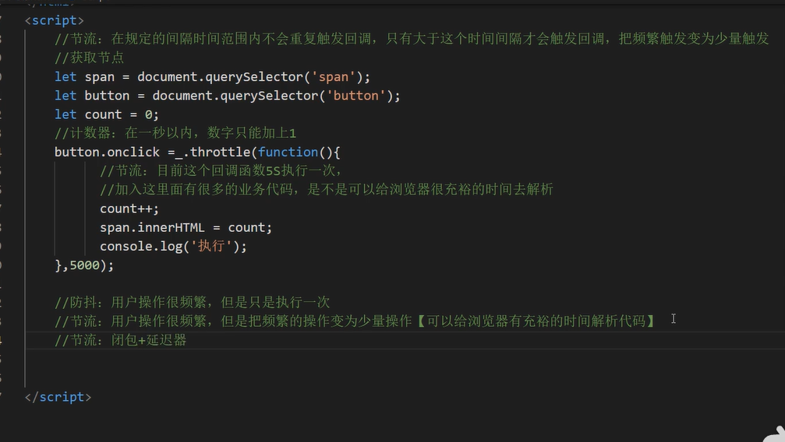
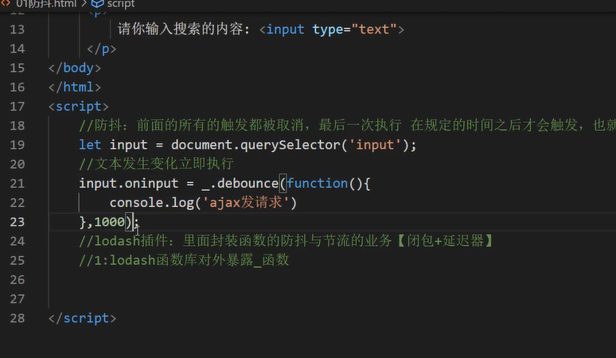
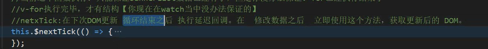

# day1

## 1.vue-cli脚手架初始化项目。

node + webpack +淘宝镜像

node modules文件夹:项目依赖文件夹

public文件夹:-般放置一些静态资源 (图片)，需要注意，放在public文件夹中的静态资源，webpack进行打包的时候，会原封不动打包到dist文件夹中。

src文件夹(程序员源代码文件夹):

> ​	assets文件夹:一般也是放置静态资源(一般放置多个组	件共用的静态资源)，需要注意，放置在assets文件夹	里面静态资源，在webpack打包的时候，webpack会把静态资源当做一个模块，打包JS文件里面。

> components文件夹:一般放置的是非路由组件(全局组	件)

> App.vue:唯-的根组件，Vue 当中的组件( . vue)
> main. js:程序入口文件，也是整个程序当中最先执行的文件

babel. config. js:配置文件(babel相关)

package. json文件:认为项目“身份证’，记录项目叫做什么、项目当中有哪些依赖、项目怎么运行。

package- lock. json:缓存性文件

## 2.其它配置

eslint校验功能关闭。
在根目录下，创建个vue. config.js
比如:声明变量但是没有使用eslint校验工具报错。

## 3.项目路由的分析

vue- router
前端所谓路由: KV键值对。
key:URL(地址栏中的路径)
value:相应的路由组件
注意:项目上中下结构

路由组件:
Home首页路由组件、Search路 由组件、login登录路由、 Register注册路由
非路由组件:
Header [首页、搜索页]
Footer [在首页、搜索页]，但是在登录页面是没有

## 4.完成非路由组件Header与Footer业务

在开发项目的时候:
1: 书写静态页面(HTML + CSS)
2:拆分组件
3:获取服务器的数据动态展示
4:完成相应的动态业务逻辑
注意1:创建组件的时候，组件结构+组件的样式+图片资源

## 5.路由组件的搭建

$route:一般获取路由信息[路径、query、 params等等]
$router:一般进行编程式导航进行路由跳转[push|replace]

路由的跳转?
路由的跳转有两种形式:
声明式导航router -link,可以进行路由的跳转
编程式导航push |replace,可以进行路由跳转

编程式导航:声明式导航能做的，编程式导航都能在，
但是编程式导航除了可以进行路由跳转，还可以做一些其他的业务逻辑。

# day2

## 1.编程式路由跳转到当前路由(参数不变)，多次执行会抛出NavigationDuplicated的警告错误?

路由跳转有两种形式: 声明式导航、 编程式导航
声明式导航没有这类问题的，因为vue router底层已经处理好了
为什么编程式导航进行路由跳转的时候，就有这种警告错误那?
"vue-router": "^3.5.3": 最新的vue - router引入promise
通过给push方法传递相应的成功、失败的回调函数，可以捕获到当前错误，可以解决。

## 2.三级联动组件完成

由于三级联动，在Home、 Search、 Detail, 把三级联动注册为全局组件。
好处:只需要注册一次，就可以在项目任意地方使用

## 3.axios二次封装

为什么需要进行二次封装axios?
请求拦截器、响应拦截器:请求拦截器，可以在发请求之前可以处理一些业务、 响应拦截器，当服务器数据返回以后， 可以处理一些事情

## 4.nprogress进度条的使用

start:进度条开始
done:进度条结束
进度条颜色可以修改的，当然需要修改人家的样式

# day3

## 1.浏览器卡顿

正常情况(用户慢慢的操作) :鼠标进入，每一个一级分类h3，都会触发鼠标进入事件。

非正常情况(用户操作很快):本身全部的级分类都应该触发鼠标进入事件，但是经过测试，只有部分h3触发了。

就是由于用户行为过快，导致浏览器反应不过来。如果当前回调函数中有一些大量业务，有可能出现卡顿现象。

## 2.防抖和节流

https://www.lodashjs.com/

节流:在规定的间隔时间范围内不会重复触发回调，只有大于这个时间间隔才会触发回调，把频繁触发变为少量触发

防抖:前面的所有的触发都被取消，最后次执行在规定的时间之后才会触发，也就是说如果连续快速的触发只会执行一次

## 3.router-link卡顿

router-link:可以一个组件，当服务器的数据返回之后，循环出很多的router- link组件[创建组件实例的] 1000+
创建组件实例的时候，一瞬间创建1000+很耗内存的，因此出现了卡顿现象。

# day4

## 1.nextick

## 2.组件通信

组件通信的方式有哪些?面试频率极高
props:用于父子组件通信
自定义事件:@on @emit 可以实现子给父通信
全局事件总线:$bus全能
pubsub-js:vue当中几乎不用全能
插槽:父子
vuex:万能

# day5

## 1.getters

简化仓库中的数据

# day6

## 1.分页

需要知道当前是第几个:pageNo字段代表当前页数
需要知道每一个需要展示多少条数据: pageSize字段进行代表
需要知道整个分页器一共 有多少条数据:total字段进行代表---[获取另外一条信息:一共多少页] 
需要知道分页器连续页码的个数:5|7 [奇数]，以为奇数对称(好看)
总结:对于分页器而言，自定义前提需要知道四个前提条件。
pageNo:当前第几个
pageSize:代表每页展示多 少条数据
total:代表整个分页一共要展示多少条数据
continues :代表分页连续页码个数

